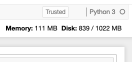
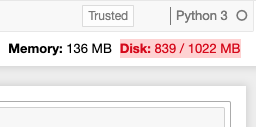

# nbresuse



NB Resource Usage (nbresuse) is a small extension for Jupyter Notebooks that
displays an indication of how much resources your current notebook server and
its children (kernels, terminals, etc) are using. This is displayed in the
main toolbar in the notebook itself, refreshing every 5s.

## Installation

You can currently install this package from PyPI.

```bash
pip install nbresuse
```

**If your notebook version is < 5.3**, you need to enable the extension manually.

```
jupyter serverextension enable --py nbresuse --sys-prefix
jupyter nbextension install --py nbresuse --sys-prefix
jupyter nbextension enable --py nbresuse --sys-prefix
```
or, if you can't write to system locations
```
jupyter serverextension enable --py nbresuse --user
jupyter nbextension install --py nbresuse --user
jupyter nbextension enable --py nbresuse --user
```

## Configuration

### Memory Limit

`nbresuse` can display a memory limit (but not enforce it). You can set this
in several ways:

1. `MEM_LIMIT` environment variable. This is set by [JupyterHub](http://github.com/jupyterhub/jupyterhub/)
   if using a spawner that supports it.
2. In the commandline when starting `jupyter notebook`, as `--ResourceUseDisplay.mem_limit`.
3. In your jupyter notebook [traitlets](https://traitlets.readthedocs.io/en/stable/) config file

The limit needs to be set as an integer in Bytes.

### Memory usage warning threshold



The background of the resource display can be changed to red when the user is near a memory limit.
The threshold for this warning can be configured as a fraction of the memory limit.

If you want to flash the warning to the user when they are within 10% of the memory limit, you
can set the parameter `--ResourceUseDisplay.mem_warning_threshold=0.1`.

## Disk Limit
`nbresuse` can monitor the disk usage in a directory for you. By default it will
monitor your home directory and warn you when the available space falls below
10% of the total space. The directory to be monitored defaults to the contents
of the `HOME` environment variable and the threshold defaults to 10% (0.1) of
free space remaining. These values can be overridden in several ways:

1. The path to monitor can be changed by setting the `HOME` environment
   variable. This is commonly set by
   [JupyterHub](https://github.com/jupyterhub/jupyterhub/) when using a
   supported spawner.
2. On the command line, when starting the notebook as
   `--ResourceUseDisplay.disk_path="/my/new/path"` and
   `--ResourceUseDisplay.disk_warning_threshold=0.1`
3. In your jupyter notebook
   [traitlets](https://traitlets.readthedocs.io/en/stable/) config file, e.g. in
   `~/.jupyter/jupyter_notebook_config.py`
```python
c.ResourceUseDisplay.disk_path="/my/new/path"
c.ResourceUseDisplay.disk_warning_threshold=0.1
```

## Resources displayed

Currently it displays Memory usage (just RSS) and disk usage. Other metrics will
be added in the future as needed.
